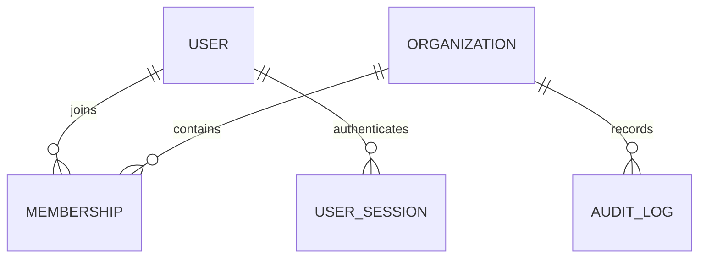

# العلاقات المنفذة

```mermaid
erDiagram
  USER ||--o{ MEMBERSHIP : joins
  ORGANIZATION ||--o{ MEMBERSHIP : contains
  USER ||--o{ USER_SESSION : authenticates
  ORGANIZATION ||--o{ AUDIT_LOG : records
```

actor_id في سجل التدقيق معرف محفوظ للهوية وقت الحدث، دون FK لتجنب إبطال الأثر التاريخي عند تطبيق سياسة إزالة الهوية لاحقاً. علاقات المهام والمشاريع والملفات لم تُضف بعد.
